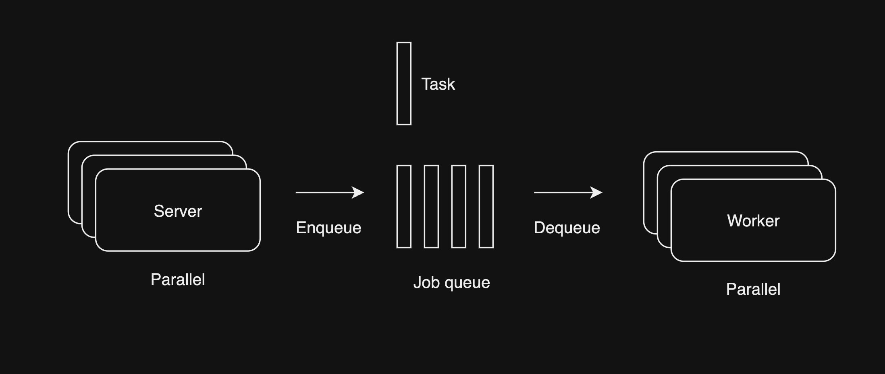

# Scheduleing

2023-07-29

---

Job queue 나 batch로 한 번에 처리하는 작업을 어떻게 잘 만들까

- 매월 특정일 구독 결제 처리
- 시간별 예약 발송 메시지 발송 처리

구독 결제의 경우 DB에서 구독데이터를 1천 개씩 질의하고 서버 메모리에서 1천 개의 구독 데이터를 순회하면서 결제하고 성공, 실패 여부 등을 기록했다. 결제는 PG 처리가 최소 1초는 소요 되기 때문에 서비스가 엄청 유명해저서 하루에 결제 처리 해야하는 건수가 10만 건이면 최소 처리 시간이 10만 초로 하루 24시간인 86400초보다 오래 걸리기 때문에 scalability 측면에서 문제가 있다. 현재 서비스는 순회 할때 내부적으로 멀티스레드로 동시에 2건씩 결제하게 하여 이 상태로도 당장은 문제가 없다.

하지만 예약 메시지 같은 시스템은 어떨까? 결제는 정확히 그 시간에 결제 할필요가 없다. 정확히 그 일자만 맞추면 될뿐 그러나 예약 메시지는 다르다. 보통 분 단위로 예약 메시지를 설정하도록 서비스들은 구현되어 있다. 이 말은 14일 15시 12분에 발송 예약 건수가 5만건 이라면 mobile push든 email이든 발송 서비스에 5만 건을 1분 안에 보내야 하므로 결제를 구현했던 방식으로는 유저가 예약 설정한 그 시간 안에 발송하기는 힘들 것 같다.

## Job Queue System

- Server는 queue에 schedule 되는 작업인 Task를 넣는다.
- Worker는 queue에서 Task를 꺼내서 처리한다.

유저는 메시지 발송을 예약하고 취소할 수 있을 건데 큐는 한번 데이터를 쌓으면 쌓인 순서대로 처리 해야한다. 그러면 큐에 쌓인 데이터를 처리하는 worker는 예약이 취소되었는지 체크 해야한다. 예약 취소시 큐에 쌓인 데이터를 직접 제거 하는 방식은 제거 하기 전에 작업이 수행될수 있기 때문에 문제가 있어 보인다.

특정 분 시간에 예약된것이 5천건이라면 worker는 큐에 쌓인 task DB 부하를 줄이기 위해 task를 수행하기 위한 필요한 데이터 모두 큐에 같이 담는것이 DB부하를 줄이는 방법일것이다.

그렇다면 지금이 14시 11분 인데 19시 20분 발송 예약 Task는 언제 큐에 넣어야 할까? 그 즉시 넣으면 당연히 Worker는 바로 Task를 처리하고 실행 될것이다. 별도의 스케줄러가 일괄로 Task를 탐색해서 넣는다면 큐에 넣었는지 여부를 Task 데이터에 담아야 할것이다.