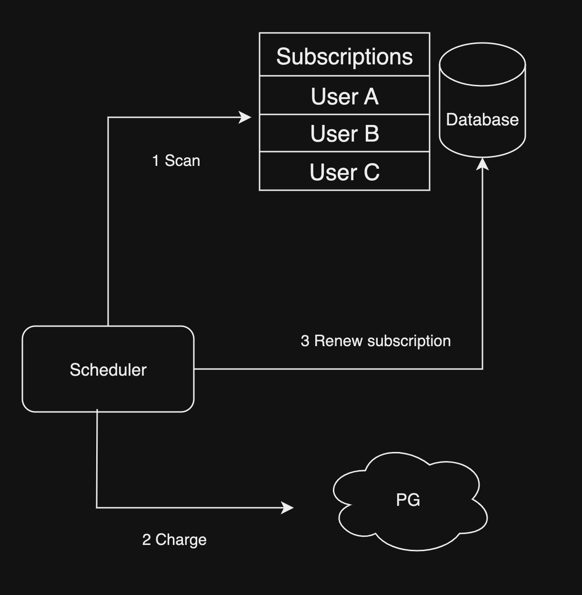

# Scheduling system

2023-07-29

---

Backend 개발을 하다 보면 Scheduling이 필요한 경우가 있다.

1. subscription 상품 매월 특정일 결제
1. 메시지 발송 예약(schedule)
1. 매주 월 금 repeat(반복) 되는 작업(reminder 등)

## 내가 구현한 구독 상품 결제

Docker로 배포된 **App server container**가 아닌 별도로 **Scheduler container**를 만들어 매분 마다 결제 대상 구독데이터를 탐색하고 순차적으로 PG 결체 처리 한 뒤 그 결과를 구독 데이터에 반영하는 방식이었다. PG 결제 처리의 경우 최소 1초 정도 소요 되고 동시 결제 건수는 3건이라는 제약사항이 있었는데 매분하다 1천개씩 탐색하고 순차적으로 결제 하도록 했다.

동시 결제 건수가 3건이기 때문에 1건은 신규 구독 결제를 위해 놔두고 스케줄러는 2개의 스레드를 만들어 Multithread로 동시에 2건식 구독 갱신 결제를 처리 하게 하였다. 이론상 특정일에 결제 대상 유저가 10만 명이라면 소요시간이 `10만(결제 건수) / 2(스레드 수) / 1.08(PG 결제 및 데이터 처리) = 약 4만6천초`가 되므로 하루에 전부 처리 할수 없게 된다. 물론 결제 건수가 이정도로 많다면 진작 PG사와 협의 하여 동시 결제 건수를 상향 해야 할것이다. 하지만 분명한건 **Scalability** 측면에서 부족한점이 보이는것은 사실이다.

## 5분 안에 처리 해야 한다면?

결제는 분, 시간 단위로 처리 될 필요 없이 그 날짜 안에만 처리하면 된다. 하지만 **예약 메시지 기능은 어떨까?** 대부분의 서비스들은 최소 5분 단위로 예약메시지를 보낼수 있는 기능을 제공한다. 1만명의 유저가 15시 15분에 메시지 발송을 예약 했다면 mobile push든 email이든 5분 단위로 사용자가 예약한 그 시점에 정확히 발송처리 해야한다.

**미래 어느 시점**에 **대량 데이터 처리**하는 시스템을 어떻게 만들지 구글링 해본결과 <https://slack.engineering/scaling-slacks-job-queue/>를 보고 영감을 받아 시스템을 디자인 해보려 한다.

## Job Queue

- 여러개의 server는 queue에 schedule 대상 작업인 task를 넣는다. (Message producer)
- 여러개의 worker는 queue에서 task를 꺼내서 처리한다. (Message consumer)

Job queue를 사용하면 **대량 데이터 처리** 처리는 DB throughput(처리량)이 허락하는한 worker 컨테이너를 늘리면 손 쉽게 해결된다. 문제는 **미래 어느 시점**이다. 큐에 쌓인 task는 큐에 넣은 순서대로 정렬 되어있는데 메시지 발송 예약은 A(14시에 19시 발송 예약), B(17시에 18시 발송 예약) 예약시점과 처리시점은 매우 동떨어질수 있다. 그렇다고 큐에 쌓을때 처리기준 시간을 넣고 큐에서 꺼낼때 현재 시간과 처리기준 시간을 비교해서 큐에서 꺼내면 A때문에 B가 처리 되지 않는 문제가 생긴다.

Job queue는 직접 프로그래밍해서 구현하는것 보다 meesage queue 서버(또는 event bus)를 사용해서 구현하는것이 message delivery guarantee(메시지 전달 보장), scalability(확장성), throughput(처리량) 완성도가 높을것이다. 대표적인 message queue는 다음과 같다.

- Redis
- Kafka
- NATS
- RabbitMQ
- ActiveMQ

대용량 처리를 위해서 Redis는 in-memory인 관계로 메모리 부족하면 메시지가 loss(유실) 되므로 제외 하고 RabbitMQ와 ActiveMQ는 올드(?)해서 제외 할것이다. 저번 프로젝트에서는 Kafka를 사용했었는데 JVM, zookeeper(현재 kafka는 필요 없긴 하지만) 기반인 관계로 NATS를 사용할것이다. NATS는 **Jetstream**라는 이름으로 Kafka의 `parallel consuming`, `offset`, `commit` 기능을 제공한다.

## 발송 예약 시스템

특정 시간에 큐에 task를 넣는 스케줄러 없이 구현하려면 간단한 방법으로는 유저가 예약을 하면 producer는 바로 메시지를 큐에 보내지만 consumer는 처리기준 시간을 비교하고 아직 처리할 메시지가 아니면 cosnumer가 producer가 되어 다시 큐에 task를 넣으면 된다. 그렇게 하면 먼저 쌓여있는 더 미래에 처리해야할 task들이 알아서 큐에 append(끝에 다시 쌓임)되므로 **task 쌓는 시점**과 관계없이 **미래 어느 시점** 문제가 해결된다.

위 방법은 **task 쌓는 시점**과 **미래 어느 시점**이 멀어질수록 큐에 쌓인 task가 많아지므로 서버간 내부 트래픽, consumer 리소스 낭비가 있어 최적화가 필요한 것으로 보이지만 발송 예약의 경우 매번 반복 되는것이 아니기 때문에 **시스템 복잡도 증가 VS 리소스 최적화** 측면에서 보자면 큰 문제는 아닌것으로 보인다.

만약 큐에 쌓인 task가 3만개인데 모두 3시간 뒤에 처리 해야할 것들이라면 consumer는 계속 큐에서 task를 꺼내고 처리 기준시간 비교 한 뒤에 큐 뒤에 다시 append 하기 때문에 3시간 동안 무한으로 계속 task 처리 없이 큐에서 task를 넣었다 뺐다 하는 리소스 낭비가 발생할수 있다.

이 문제는 비교적 간단하게 해결 할수 있는게 **NATS JetStream**은 `stream`안에 여러 `subject`를 dynamic(가변)하게 만들수 있다. 예약 발송 처리 전용 큐로 `stream`을 만들고 발송 기준 시간을 10분 단위로 epoch millisecond `subject`로 만들면 consumer는 현재 시간이 속한 **10분 단위 subject**에서 task를 꺼내고 기준 시간이 안디면 다시 넣으면 되겠다. subject를 1분단위 시간으로 만들지 않는 이유는 혹시나 consumer의 throughput(처리량)이 부족해서 1분 안에 처리 못하는 task가 생길수 있기 때문이다.

유저는 메시지 발송을 예약하고 취소할 수 있기 때문에 consumer는 처리 기준 시간이 되었어도 유저가 취소한 task인지 확인해야한다. Redis에 HashMap 자료 구조로 발송 취소여부 데이터를 저장하고 consumer가 확인하여 처리 하면 될것 같다.

Task를 큐에 담을때 유저 고유 아이디만 저장하면 consumer가 각 메시지 마다 발송 주소, 메시지 내용등을 확인하기 위해 DB를 사용해야 하므로 task처리를 위한 모든 데이터를 같이 task에 담아 consumer가 별다른 서비스 데이터에 접근할 필요 없게 하는게 좋을것 같다.

## 반복 작업 스케줄링

반복 작업 스케줄링은 큐에 task를 넣는 스케줄러가 필요하다. 큐에 task를 넣는 스케줄러는 큐에 task를 넣는 producer와 같은 역할을 하므로 producer가 스케줄러가 되면 된다. producer가 스케줄러가 되면 consumer는 큐에서 task를 꺼내서 처리하는 역할만 하면 되므로 consumer는 worker가 된다.

데이터 모델링 다음 작업은 어느 시점에 넣는가? 스케줄러가 스캔 해서 넣는다?

처리 완료 여부 task 연관된 원천 데이터에 update? 별도 task 로그 엔티티에 insert? 이거 고민더 하고 작성
